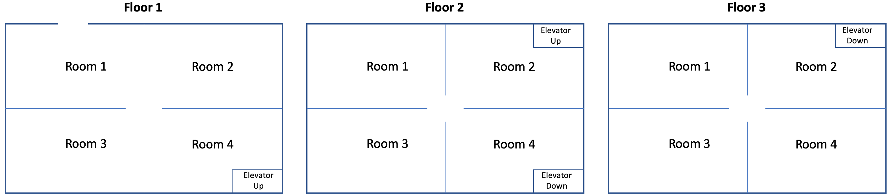

# Exam 1

## Rules of Behavior
1. Do not communicate with anyone during the exam (no email, no social media, no Discord, no texting, no phones, no talking, no passing notes, no internet communicating).  If there is any evidence of communicating with anyone during the exam you will receive a zero.
1. You **must** turn off your cell phone and store it away.
1. Your submission **must** be solely you own work without the assistance of anyone by any means.
1. All programming code **must** be written in Python.
1. You **must** use Tuffix to unit test your program.
1. All your code **must** be pushed to Github by the scheduled end of class today.  Any submissions after that time will not be considered.
1. You may use your book.
1. You may use the Internet as a **reference only**.
1. If you have questions, approach the instructor desk.

## Getting Started
1. Open the Terminal program in Tuffix.
1. Change the present working directory to the `Documents` directory by typing the following command at the command prompt:

    ```
    cd Documents
    ```

1. Make a copy of this Github repository on your computer using the `git` and `clone` commands that you will input to the terminal. The commands take a URL as a parameter to specify where it can get a copy of the repository. You can find the URL by clicking on the green *Clone or download* button at the top right part of this page. Copy the URL and replace the example text shown below. Note that `username` should be replaced with your own Github username. When you hit <kbd>Enter</kbd> it will ask you to provide your Github username and token. Once done, you will have a copy of the repository on your computer.
    ```
    git clone https://github.com/CSUF-CPSC223P-STMAY-2022S/exam01s22x-username.git
    ```
1. Navigate into the new directory using the command line. Note that `username` should be replaced with your own Github username.  As a shortcut, you can type the first few letters of the folder name and press <kbd>Tab</kbd> so that it auto completes the folder name for you.

     ```
     cd exam01s22x-username
     ```
     
## Program Instructions
1. Write a Python program that performs as a Tuffy Titan Building Access Tracker.  The program simulates people entering and exiting a building and moving around floors and rooms.  Each time a person transitions between rooms their electronic id passes through a receiver that notes the room they are entering. The following building floor plan can be used as a reference:
<p align="center">
  
</p>

1. Your are given a main.py file which defines a three level nested list data structure as follows:
     ```
     outer level: floor number
     middle level: room number
     inner level: id of person in the room
     ```
	While this data is given in the main.py file, your transition function should accept any data that meets the above data structure.  The main.py file also prints out the floors and rooms showing the number of people in the room and the id's of the people in each room. The main.py will prompt the user for the id of the person and the room that the person will enter.  You will then need to insert the code in the main.py to call your transition function and print out the error code if the function returns a value other than zero.  The main.py will stay in this loop until the user types a zero as the id.  You can run the main.py file before you build your module and it will display the contents of the data structure based on some initialized data.
1. Create a `tracker` module to meet the following requirements:
     1. Create a file named `tracker.py`.
     1. Define a function named `transition` to meet the following requirements:
          1. Take a `tracker` list as a keyword parameter. The list should follow the three level nested list data structure listed above.
          1. Take a `id` string as a keyword parameter.  The string should be exactly 3 characters.
          1. Take a `enter` string as a keyword parameter.  The string should contain the floor and room using the format '#-#' where floor is the first # and room is the second #.
          1. If the id is not 3 characters, return an integer value of 901.
          1. If the floor is not a number, return an integer value of 902.
          1. If the floor is less than 1, return an integer value of 903.
          1. If the floor is greater than 3, return an integer value of 904.
          1. If the room is not a number, return an integer value of 905.
          1. If the room is greater than 4, return an integer value of 906.
          1. If the requested move is invalid, return an integer value of 999. Valid moves must adhere to the following rules:
               1. The outside of the building is room 0.
               1. People can only enter and exit the building through floor 1 room 1.
               1. People can move from any room on floor 1 to any other room on floor 1.
               1. People can only move between floor 1 to floor 2 from rooms 4 on each floor.
               1. People can move from any room on floor 2 to any other room on floor 2.
               1. People can only move between floor 2 to floor 3 from rooms 2 on each floor.
               1. People can move from any room on floor 3 to any other room on floor 3.
          1. Remove the id from the list unless the person is entering the building from outside.
          1. Add the id to the requested floor-room in the list unless the person is exiting the building.
          1. Return an integer value of 0.
1. Example output (Note: the number between the * is the number of people in the room):

    ```
	************ TUFFY TITAN BUILDING ACCESS TRACKER ************
	|--------(F1)-------|--------(F2)-------|--------(F3)-------|
	|                   |                   |                   |
	|(R1) *0* |(R2) *1* |(R1) *0* |(R2) *3* |(R1) *0* |(R2) *0* |
	|         |   f3e   |         |   d2d   |         |         |
	|         |         |         |   f6a   |         |         |
	|         |         |         |   c8c   |         |         |
	|---------|---------|---------|---------|---------|---------|
	|(R3) *2* |(R4) *0* |(R3) *0* |(R4) *0* |(R3) *2* |(R4) *1* |
	|   a9b   |         |         |         |   e8c   |   a0a   |
	|   c6e   |         |         |         |   d1e   |         |
	|         |         |         |         |         |         |
	|-----------------------------------------------------------|

	Identity (0 to exit): a0b
	Enter (Floor-Room)  : 1-1

	************ TUFFY TITAN BUILDING ACCESS TRACKER ************
	|--------(F1)-------|--------(F2)-------|--------(F3)-------|
	|                   |                   |                   |
	|(R1) *1* |(R2) *1* |(R1) *0* |(R2) *3* |(R1) *0* |(R2) *0* |
	|   a0b   |   f3e   |         |   d2d   |         |         |
	|         |         |         |   f6a   |         |         |
	|         |         |         |   c8c   |         |         |
	|---------|---------|---------|---------|---------|---------|
	|(R3) *2* |(R4) *0* |(R3) *0* |(R4) *0* |(R3) *2* |(R4) *1* |
	|   a9b   |         |         |         |   e8c   |   a0a   |
	|   c6e   |         |         |         |   d1e   |         |
	|         |         |         |         |         |         |
	|-----------------------------------------------------------|

	Identity (0 to exit): a0b
	Enter (Floor-Room)  : 1-4

	************ TUFFY TITAN BUILDING ACCESS TRACKER ************
	|--------(F1)-------|--------(F2)-------|--------(F3)-------|
	|                   |                   |                   |
	|(R1) *0* |(R2) *1* |(R1) *0* |(R2) *3* |(R1) *0* |(R2) *0* |
	|         |   f3e   |         |   d2d   |         |         |
	|         |         |         |   f6a   |         |         |
	|         |         |         |   c8c   |         |         |
	|---------|---------|---------|---------|---------|---------|
	|(R3) *2* |(R4) *1* |(R3) *0* |(R4) *0* |(R3) *2* |(R4) *1* |
	|   a9b   |   a0b   |         |         |   e8c   |   a0a   |
	|   c6e   |         |         |         |   d1e   |         |
	|         |         |         |         |         |         |
	|-----------------------------------------------------------|

	Identity (0 to exit): a0b
	Enter (Floor-Room)  : 2-4

	************ TUFFY TITAN BUILDING ACCESS TRACKER ************
	|--------(F1)-------|--------(F2)-------|--------(F3)-------|
	|                   |                   |                   |
	|(R1) *0* |(R2) *1* |(R1) *0* |(R2) *3* |(R1) *0* |(R2) *0* |
	|         |   f3e   |         |   d2d   |         |         |
	|         |         |         |   f6a   |         |         |
	|         |         |         |   c8c   |         |         |
	|---------|---------|---------|---------|---------|---------|
	|(R3) *2* |(R4) *0* |(R3) *0* |(R4) *1* |(R3) *2* |(R4) *1* |
	|   a9b   |         |         |   a0b   |   e8c   |   a0a   |
	|   c6e   |         |         |         |   d1e   |         |
	|         |         |         |         |         |         |
	|-----------------------------------------------------------|

	Identity (0 to exit): a0b
	Enter (Floor-Room)  : 3-4
	ERROR: 999

	************ TUFFY TITAN BUILDING ACCESS TRACKER ************
	|--------(F1)-------|--------(F2)-------|--------(F3)-------|
	|                   |                   |                   |
	|(R1) *0* |(R2) *1* |(R1) *0* |(R2) *3* |(R1) *0* |(R2) *0* |
	|         |   f3e   |         |   d2d   |         |         |
	|         |         |         |   f6a   |         |         |
	|         |         |         |   c8c   |         |         |
	|---------|---------|---------|---------|---------|---------|
	|(R3) *2* |(R4) *0* |(R3) *0* |(R4) *1* |(R3) *2* |(R4) *1* |
	|   a9b   |         |         |   a0b   |   e8c   |   a0a   |
	|   c6e   |         |         |         |   d1e   |         |
	|         |         |         |         |         |         |
	|-----------------------------------------------------------|

	Identity (0 to exit): a0b
	Enter (Floor-Room)  : 1-0
	ERROR: 999

	************ TUFFY TITAN BUILDING ACCESS TRACKER ************
	|--------(F1)-------|--------(F2)-------|--------(F3)-------|
	|                   |                   |                   |
	|(R1) *0* |(R2) *1* |(R1) *0* |(R2) *3* |(R1) *0* |(R2) *0* |
	|         |   f3e   |         |   d2d   |         |         |
	|         |         |         |   f6a   |         |         |
	|         |         |         |   c8c   |         |         |
	|---------|---------|---------|---------|---------|---------|
	|(R3) *2* |(R4) *0* |(R3) *0* |(R4) *1* |(R3) *2* |(R4) *1* |
	|   a9b   |         |         |   a0b   |   e8c   |   a0a   |
	|   c6e   |         |         |         |   d1e   |         |
	|         |         |         |         |         |         |
	|-----------------------------------------------------------|

	Identity (0 to exit): aa
	Enter (Floor-Room)  : 1-1
	ERROR: 901

	************ TUFFY TITAN BUILDING ACCESS TRACKER ************
	|--------(F1)-------|--------(F2)-------|--------(F3)-------|
	|                   |                   |                   |
	|(R1) *0* |(R2) *1* |(R1) *0* |(R2) *3* |(R1) *0* |(R2) *0* |
	|         |   f3e   |         |   d2d   |         |         |
	|         |         |         |   f6a   |         |         |
	|         |         |         |   c8c   |         |         |
	|---------|---------|---------|---------|---------|---------|
	|(R3) *2* |(R4) *0* |(R3) *0* |(R4) *1* |(R3) *2* |(R4) *1* |
	|   a9b   |         |         |   a0b   |   e8c   |   a0a   |
	|   c6e   |         |         |         |   d1e   |         |
	|         |         |         |         |         |         |
	|-----------------------------------------------------------|

	Identity (0 to exit): a0c
	Enter (Floor-Room)  : 1-5
	ERROR: 906

	************ TUFFY TITAN BUILDING ACCESS TRACKER ************
	|--------(F1)-------|--------(F2)-------|--------(F3)-------|
	|                   |                   |                   |
	|(R1) *0* |(R2) *1* |(R1) *0* |(R2) *3* |(R1) *0* |(R2) *0* |
	|         |   f3e   |         |   d2d   |         |         |
	|         |         |         |   f6a   |         |         |
	|         |         |         |   c8c   |         |         |
	|---------|---------|---------|---------|---------|---------|
	|(R3) *2* |(R4) *0* |(R3) *0* |(R4) *1* |(R3) *2* |(R4) *1* |
	|   a9b   |         |         |   a0b   |   e8c   |   a0a   |
	|   c6e   |         |         |         |   d1e   |         |
	|         |         |         |         |         |         |
	|-----------------------------------------------------------|

	Identity (0 to exit): 0
    ```
1. Edit and run the main.py file to test all the modules and functions using the command below and repeat the steps above until you are satisfied your program output meets the above requirements. I will not grade this file - it is for your use to test the package.

    ```
    python3 -m main
    ```

1. Run the unit testing program to ensure that your program runs as expected.

    ```
    ./test.sh
    ```
       
    The unit testing will output the results of a series of tests using specific input and expected output.  Any error will provide information on where the expected output is different from the actual output.  You will need to edit your source code to fix the error and run `./test.sh` repeatedly until it passes all the test.

## Submission
Periodically throughout the exercise, and when you have completed the exercise, **submit the complete repository to Github**.

   <pre>git add .<br>git commit -m "<i>your comment</i>"<br>git push</pre>

In case it asks you  to configure global variables for an email and name, just copy the commands it provides then replace the dummy text with your email and Github token.

   <pre>git config --global user.email "<i>tuffy@csu.fullerton.edu</i>"<br>git config --global user.name "<i>Tuffy Titan</i>"<br>git commit -m "<i>your comment</i>"<br>git push</pre>

When you completed the final Github push, go back into github.com through the browser interface and ensure all your files have been correctly updated.  You should have the following files:
```
tracker.py
test.txt
```
    
## Grading
1. All points add up to a total of 100 points possible as detailed below.  Partial credit will be given where applicable.

| Points | Description |
| --- | --- |
|50|initial git clone of this repository to your Tuffix machine|
|10|tracker.py file submitted contains the contacts module and meets the program requirements|
|2|unit test passes Test01_id_not_equal_to_3_chars|
|2|unit test passes Test02_enter_floor_not_number|
|2|unit test passes Test03_enter_floor_less_than_1|
|2|unit test passes Test04_enter_floor_greater_than_3|
|2|unit test passes Test05_enter_room_not_number|
|2|unit test passes Test06_enter_room_greater_than_4|
|2|unit test passes Test07_invalid_move_enter_floor_2_from_outside|
|2|unit test passes Test08_invalid_move_enter_floor_3_from_outside|
|2|unit test passes Test09_invalid_move_enter_floor_2_from_floor_1_room_3|
|2|unit test passes Test10_invalid_move_enter_floor_3_from_floor_1_room_3|
|2|unit test passes Test11_invalid_move_enter_floor_3_from_floor_2_room_3|
|2|unit test passes Test12_valid_move_enter_floor_1_room_1_from_outside|
|2|unit test passes Test13_valid_move_enter_floor_1_room_4_from_floor_1_room_1|
|2|unit test passes Test14_valid_move_enter_floor_2_room_4_from_floor_1_room_4|
|2|unit test passes Test15_valid_move_enter_floor_2_room_2_from_floor_2_room_4|
|2|unit test passes Test16_valid_move_enter_floor_3_room_2_from_floor_2_room_2|
|2|unit test passes Test17_valid_move_enter_floor_2_room_2_from_floor_3_room_2|
|2|unit test passes Test18_valid_move_enter_floor_2_room_4_from_floor_2_room_2|
|2|unit test passes Test19_valid_move_enter_floor_1_room_4_from_floor_2_room_4|
|2|unit test passes Test20_valid_move_enter_outside_from_floor_1_room_1|
